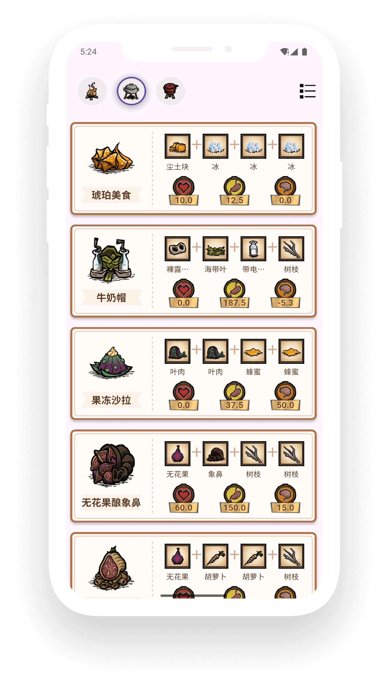
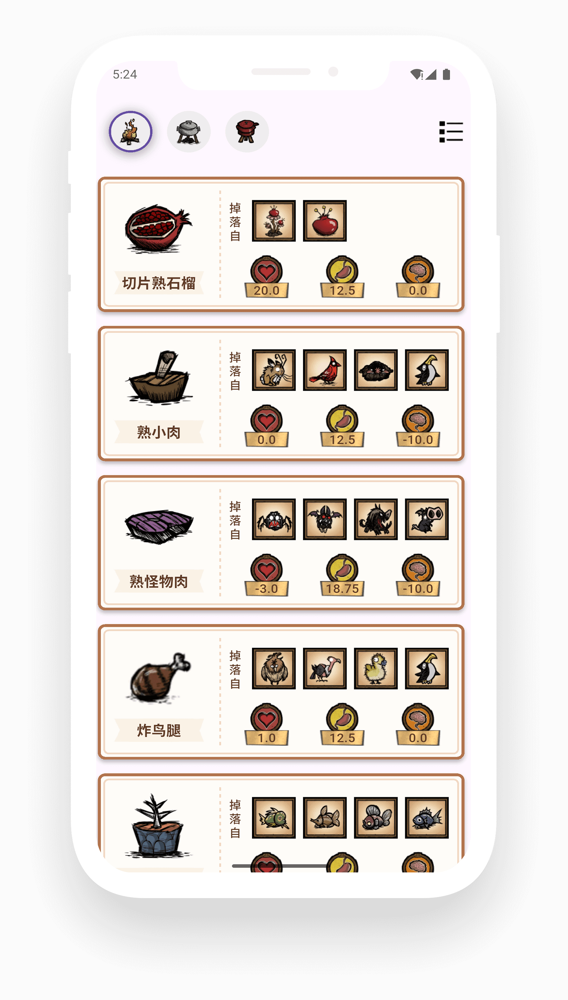
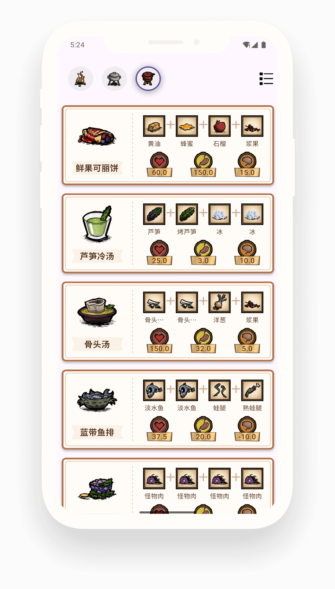

# dst_wok

由Flutter构建的跨平台“饥荒联机版”食谱攻略查询程序

## 支持平台
- Android 10 及以上
- iOS (需要自签名)

## 程序截图
<table>
  <tr>
    <td></td>
    <td></td>
    <td></td>
  <tr>
</table>

## 功能 / 开发计划

- [ ] windows平台支持
- [ ] 食谱卡片排序
- [ ] 主题切换
- [ ] 食谱图鉴
- [ ] 食谱合成工具
- [ ] 创意工坊模组食谱
- [ ] 还有更多加载中...

## 参考文献

本项目资料文件来源于 [灰机wik](https://dontstarve.huijiwiki.com/wiki/) 饥荒板块

## 免责声明

本项目基于 GNU 通用公共许可证第 3 版（GPL-3.0）授权。我们不对其适用性、可靠性或准确性作出任何明示或暗示的保证。在法律允许的最大范围内, 作者和贡献者不承担任何因使用本软件而产生的直接、间接、偶然、特殊或后果性的损害赔偿责任。
使用本项目需遵守所在地法律法规, 不得进行任何侵犯第三方知识产权的行为。因使用本项目而产生的数据和缓存应在24小时内清除, 超出 24 小时的使用需获得相关权利人的授权。

## 隐私政策 (Privacy policy)

我们不收集任何用户数据。